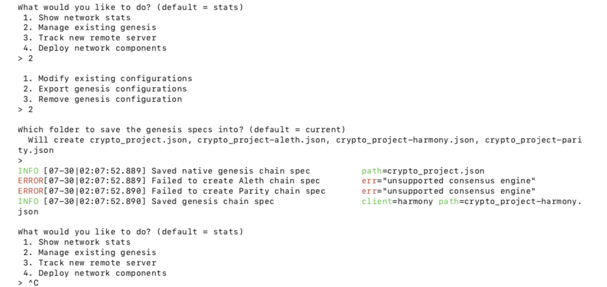
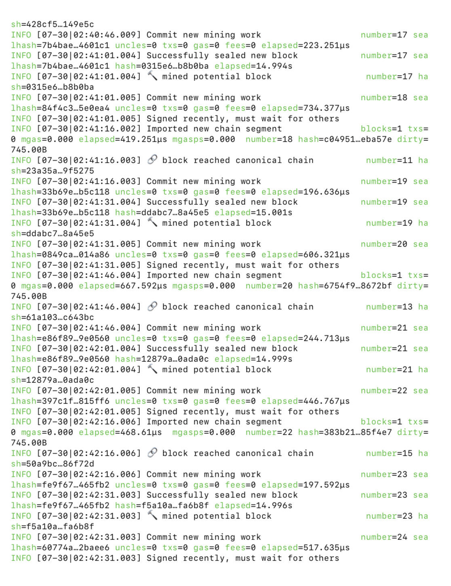

# Proof of Authority Development Chain¶

### In this proeject I will set up a testnet blockchain. To do this, I will create the following deliverables:
1.  Set up my custom testnet blockchain
2.  Send a test transaction 

## 1. Create accounts and setup the out-of-the-box blockchain:
To setup my custom testnet blockchain, I will go through the following steps:

 1.  Create node accounts
 2. Setup a new genesis block (./puppeth)
 3.  Initiate the nodes
 4.  Start mining
### Create Node Accounts:
- First, I navigated into the blockchain_tools directory
- Second, I created two accounts for two nodes for the network with a separate datadir for each using geth .

          ./geth account new --datadir node1

          ./geth account new --datadir node2
- I stored the public address for both nodes to a local text file so I can use it later

### Setup New Genesis Block:
- To setup a new genesis, run the following command:  

           ./puppeth
- I chose the name 'crypto_project' for my network, and saved it in the current directory
- I selected proof-of-authority consensus, and entered (555) as a chainID 
- Next, I entered both node1 and node2 account addresses into the list of accounts to seal and into the list of accounts to pre-fund
- To keep genesis cleaner, I selected 'no' for pre-funding the pre-compiled accounts

- Next, I exported genesis configurations and saved the genesis 'crypto_project.json' in the current directory
    
### Initiate the Nodes:
- I initiated the nodes by running the following commands:

    
         ./geth init crypto_project.json --datadir node1
         ./geth init crypto_project.json --datadir node2
    
### Start Mining:
- Started mining by running the the following commands:
    - Node1 command:

             ./geth --datadir node1 --unlock"{node1 key}" --mine --rpc --allow-insecure-unlock
- As we can see in the above command, we unlocked the first node by entering its address that we stored on a local text file (each node has a unique address)
- I copied the full enode address here in order to run ndoe2 

    - Node2 command:

             ./geth --datadir node_2 --mine --port 30304 --bootnodes "{enode of node2}" --unlock "{node2 key}" --allow-insecure-unlock.
    - I unlocked  node2 by first entering the enode address that I copied from node1, that will allow the two nodes to communicate
    - I then entered the public key of node2 to run it as shown in the screenshots
 
 
 
 

## 2. Send Transactions
To send a transaction, I have done the following:

 1. Use MyCrypto to setup a custom network 
 2. Login to node1 account 
 3. Check whether you have a sufficient balance in your account
4. Enter address to send a transaction

### Setup a Custom Network:
- First, I setup a custom network using MYCrypto  
    - I first clicked on 'Change Network', then 'Add Custom Node'
    - entered crypto_project as Node Name
    - changed network to custom
    - entered ChainID as 555, which is the same chainID number I chose when I first created the genesis block)

### Login to Node1 Account 
- Here, I opened MYCrypto to login to node1 account by importing the keystore file that was generated when node1 account was first created

### Sufficient Balance
- Here, I have enough balance to send a transaction  

### Send Transaction
- I sent a 500 ETH from my node1 account to my node2 account 

- Check transaction status

- Check transaction on terminal

